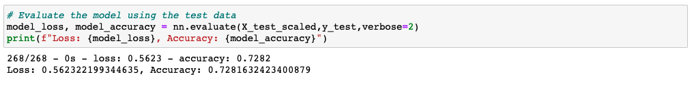
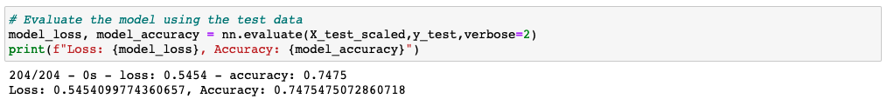

# Charity Funding Predictor

Prepared by Corey Lawson-Enos

## Overview
* A TensorFlow, neural network, binary classification model used to predict if a funded organization will be successful based on features in the test charity's dataset.

## Technologies
Pandas, TensorFlow, Scikit-learn, Jupyter Notebook

## Access/Resources
* Data source: 'charity_data.csv' file saved to Resources folder in this repository. 
* Initial Test Study Files:
    - Use 'AlphabetSoupCharity.ipynb' Jupyter Notebook in this repository to recreate initial test study.
    - Model saved as 'AlphabetSoupCharity.h5'.
    - Model weights for every five epochs saved to following repository directory: 'Weights/Initial/'
* Optimized Test Study Files:
    - Use 'AlphabetSoupCharity_Optimization.ipynb' Jupyter Notebook in this repository to recreate optimized study.
    - Optimized model saved as 'AlphabetSoupCharity_Optimization.h5'.
    - Optimized model weights for every five epochs saved to following repository directory: 'Weights/Optimization/'

## Results

### Data Preprocessing
* Variable target: 'IS_SUCCESSFUL' binary classifier.
* Features included:
    - APPLICATION_TYPE
    - AFFILIATION
    - CLASSIFICATION
    - USE_CASE
    - ORGANIZATION
    - STATUS
    - INCOME_AMT
    - SPECIAL_CONSIDERATIONS
    - ASK_AMT
    - IS_SUCCESSFUL
* The following features were removed since they serve as applicant identifiers only: 
    - EIN
    - NAME

### Compiling, Training, and Evaluating the Model
* 'APPLICATION_TYPE' and 'CLASSIFICATION' values with nominal counts were binned together into an 'Other' category to reduce noise.
* After converting categorical data to numeric and splitting off the target 'IS_SUCCESSFUL' array, forty-two (42) features remained.
* Given this larger number of final features, the model was initiated with three layers, one hundred (100) epochs as follows:
    - First Layer: Eighty (80) neurons, ReLU as activation function
    - Second Layer: Thirty (30) neurons, ReLU as activation function
    - Output Layer: One (1) neuron, Sigmoid as activation function
    - Total Parameters: 5,981
    - Result: 73% accuracy per the following snapshot:

### Optimization Model Adjustments
* The 'STATUS' binary classification feature was also removed. It is presumed that since this is a historical dataset charting completed initiatives, an applicant's active/inactive system status when the dataset was assembled has no determination on historical success which has already been decided.
* 'INCOME_AMT' value counts >$1M were also binned together to further reduce noise.
* 'ASK_AMT' outlier values calculated at > $11,886 were trimmed.
* An adjusted thirty-nine (39) features remained.
* Model layers were then added and adjusted in multiple tests. Epochs were also tested in range 10-500. Final accepted optimization as follows, with one hundred (100) epochs only:
    - First Layer: Eighty (80) neurons, ReLU as activation function
    - Second Layer: Sixty (60) neurons, ReLU as activation function
    - Third Layer: Forty (40) neurons, Sigmoid as activation function
    - Output Layer: One (1) neuron, Sigmoid as activation function
    - Total Parameters: 5,981
    - Result: Target 75% accuracy per the following snapshot:

## Summary

It took no small amount of trial and error to approach the 75% accuracy goal--repeatedly adjusting the combination of layers, neurons, activation functions, and epochs in particular. Recommendation: Use KerasTuner testing on the optimized dataset to more accrurately determine a nominal neural network model.

## Source

* 2022 Trilogy Education Services, a 2U, Inc. brand. All Rights Reserved.

## Contact
E-mail: clawson131@gmail.com 
LinkedIn: https://www.linkedin.com/in/corey-lawson-enos/
